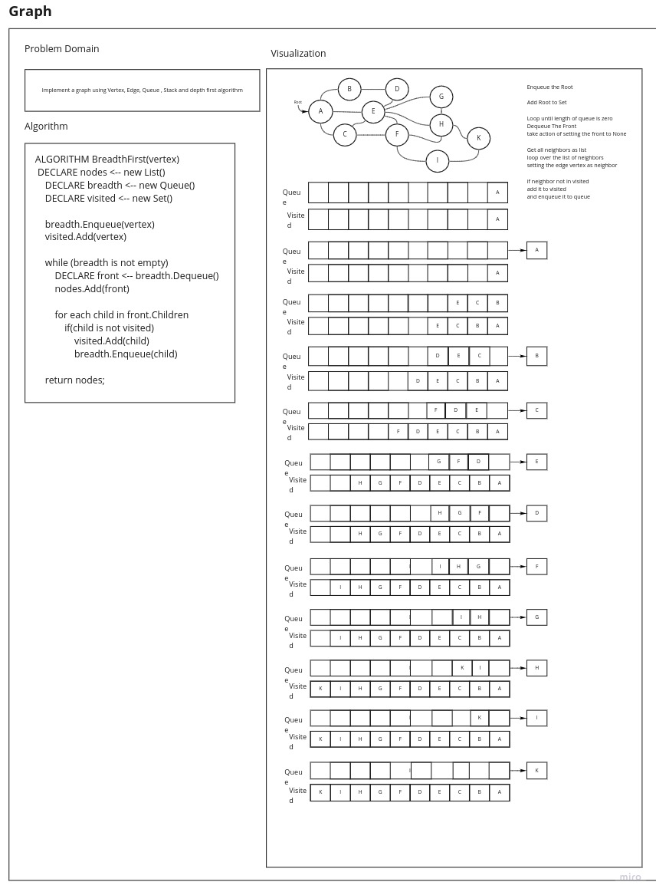

# Graphs Implementation:

## Challenge

Implement Graphs

## Approach & Efficiency

-   Time :
-   Space :

## Feature Tasks

-   [x] Implement your own Graph. The graph should be represented as an adjacency list, and should include the following methods:

-   [x] add node - [] Arguments: value - [] Returns: The added node
    Add a node to the graph
-   [x] add edge
    -   [x] Arguments: 2 nodes to be connected by the edge, weight (optional)
    -   [x] Returns: nothing
    -   [x] Adds a new edge between two nodes in the graph
    -   [x] If specified, assign a weight to the edge
    -   [x] Both nodes should already be in the Graph
-   [x] get nodes
    -   [x] Arguments: none
    -   [x] Returns all of the nodes in the graph as a collection (set, list, or similar)
-   [x] get neighbors - [] Arguments: node - [] Returns a collection of edges connected to the given node
    Include the weight of the connection in the returned collection
-   [x] size
    -   [x] Arguments: none
    -   [x] Returns the total number of nodes in the graph

## Structure and Testing

Write tests to prove the following functionality:

-   [x] Node can be successfully added to the graph
-   [x] An edge can be successfully added to the graph
-   [x] A collection of all nodes can be properly retrieved from the graph
-   [x] All appropriate neighbors can be retrieved from the graph
-   [x] Neighbors are returned with the weight between nodes included
-   [x] The proper size is returned, representing the number of nodes in the graph
-   [x] A graph with only one node and edge can be properly returned
-   [x] An empty graph properly returns null

# White Board

