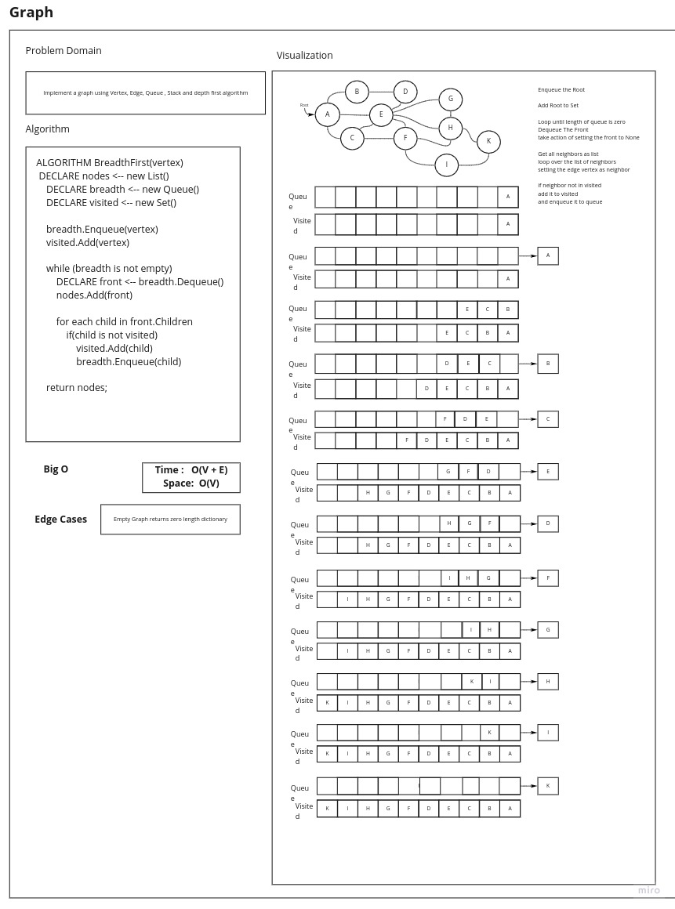
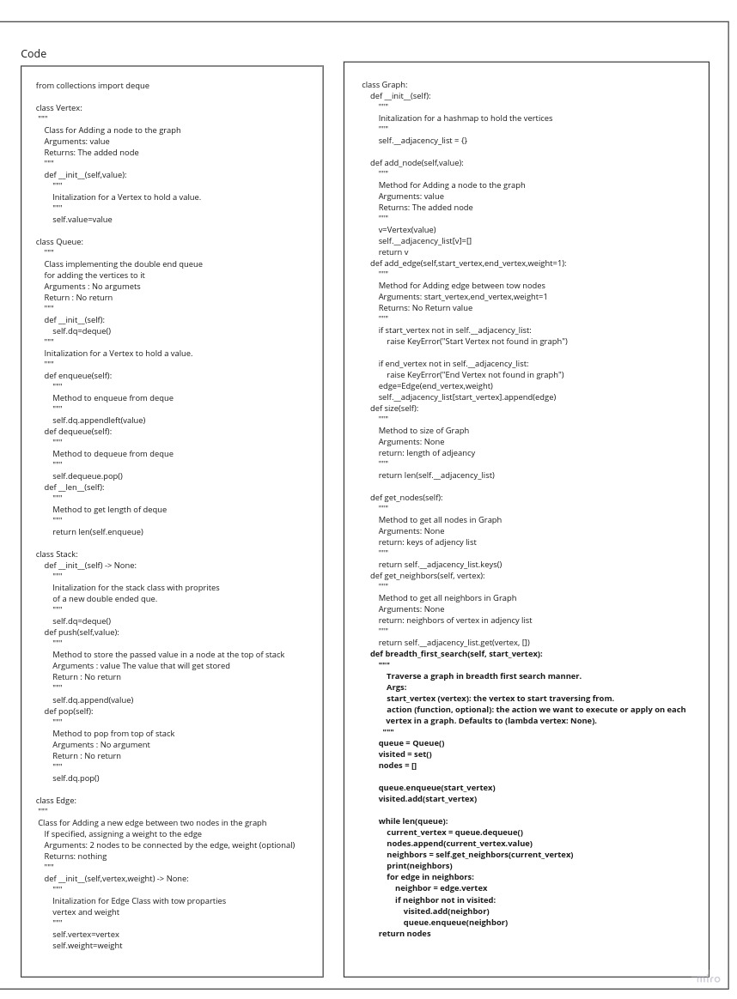

# Graph breadth first

## Challenge

Implement a breadth-first traversal on a graph.

## Approach & Efficiency

-   Time : O(V+E)
-   Space : O(V)

## Feature Tasks
* [X] Write the following method for the Graph class:

- [X] breadth first
    - [X] Arguments: Node
    - [X] Return: A collection of nodes in the order they were visited.
    - [X] Display the collection

## Structure and Testing

* [X] Write at least three test assertions for each method that you define.

# White Board

