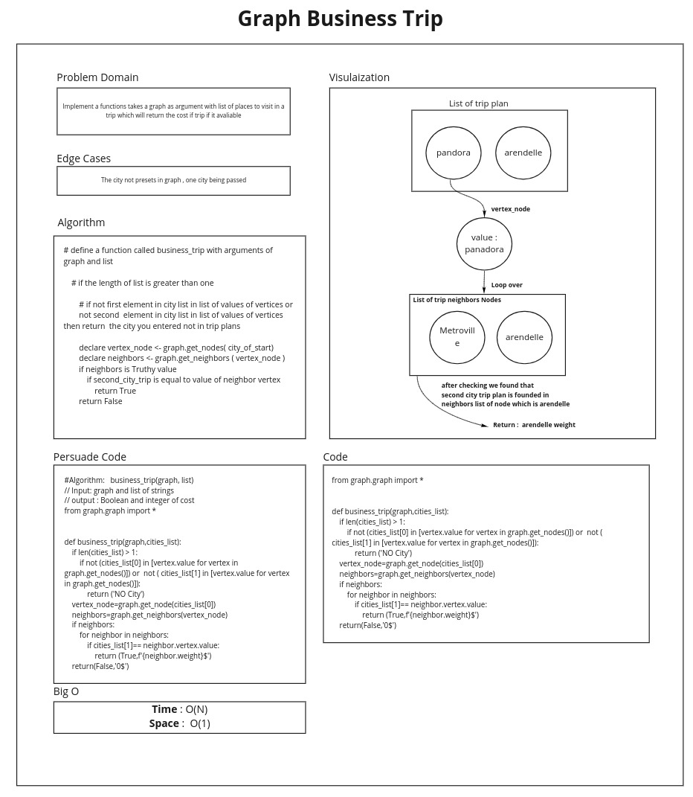

# Graph business trip

## Challenge

Given a business trip itinerary, and an Alaska Airlines route map, is the trip possible with direct flights? If so, how much will the total trip cost be?

## Approach & Efficiency

-   Time : O(N)
-   Space : O(1)

## Feature Tasks
* [x] Write a function called business trip
    - [x] Arguments: graph, array of city names
    - [x] Return: cost or null

## Structure and Testing

* [x] Write at least three test assertions for each method that you define.

# White Board

