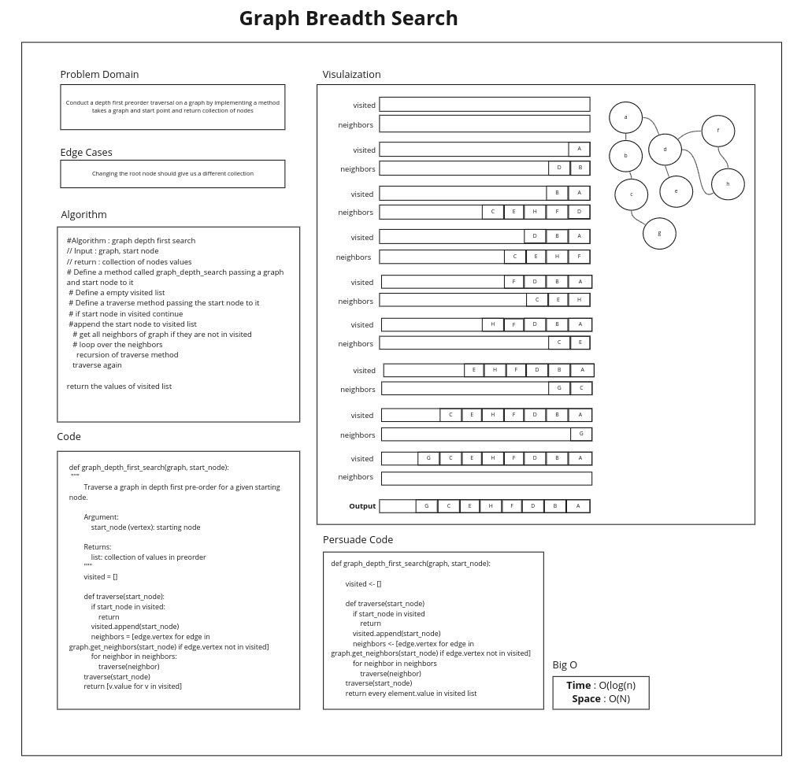

# Graph Depth first

## Challenge

Conduct a depth first preorder traversal on a graph

## Approach & Efficiency

- Time : O(log(N))
- Space : O(N)

## Feature Tasks

- [x] Write the following method for the Graph class:

  - [x] Name: Depth first
  - [x]Arguments: Node (Starting point of search)
  - [x] Return: A collection of nodes in their pre-order depth-first traversal order
  - [x] Program output: Display the collection

## Structure and Testing

- [x] Write at least three test assertions for each method that you define.

# White Board

