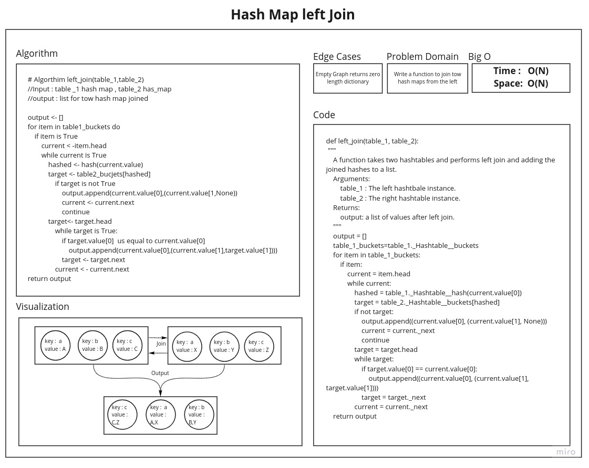

# Hashmap Left Join

Join a tow hasmaps from left side

## Challenge

Implementation of simplified LEFT JOIN for 2 Hashmaps.

## Approach & Efficiency

Time :
Space :

## Features
* [x] Write a function called left join
    - [x] Arguments: two hash maps
    - [x] The first parameter is a hashmap that has word strings as keys, and a synonym of the key as values.
    - [x] The second parameter is a hashmap that has word strings as keys, and antonyms of the key as values.
    - [x] Return: The returned data structure that holds the results is up to you. It doesn’t need to exactly match the output below, so long as it achieves the LEFT JOIN logic

## Test Requirements

* [x] Write at least three test assertions for each method that you define.

## White Board

