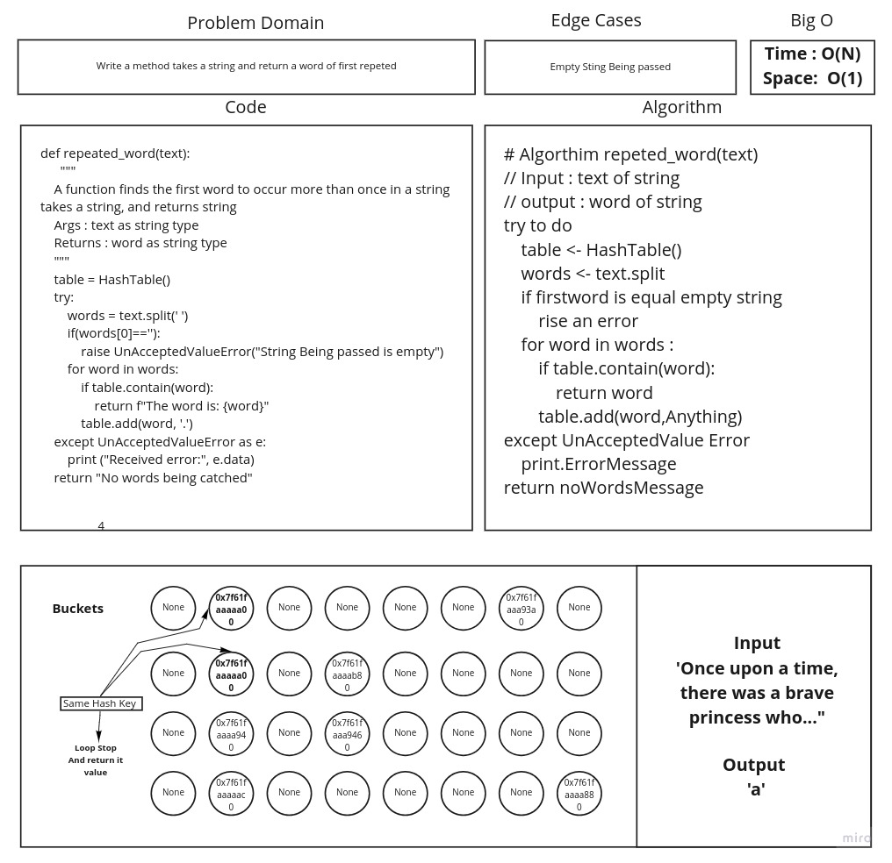

# Hash Map repeted words

## Challenge

Write a function which finds the first word to occur more than once in
depending on hashmap implementation

## Approach & Efficiency

Time : O(N)
Space : O(1)

## Feature Tasks

* [x] Write a function called repeated word that finds the first word to occur more than once in a string
    - [x] Arguments: string
    - [x] Return: string

## Requirements

* [x] Write unit tests
# White Board

