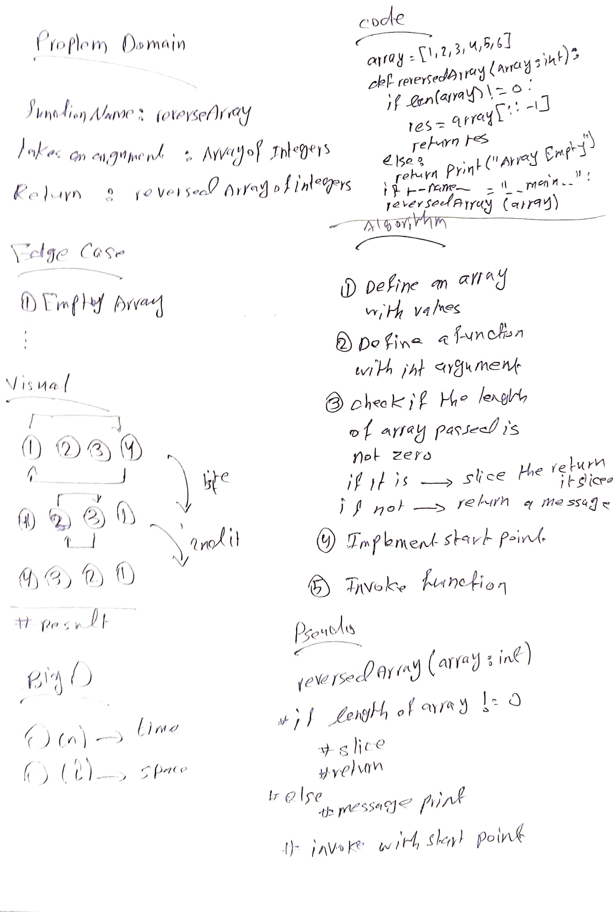

# Reverse an Array

<!-- Description of the challenge -->

The challange is about creating a function accept an array of integers as argument
and returning new array with reversed elements

## Whiteboard Process

<!-- Embedded whiteboard image -->

## Approach & Efficiency

<!-- What approach did you take? Discuss Why. What is the Big O space/time for this approach? -->

I think that the effecincy of slicing is about O(n) grade while the n is the size of
observaition that pass to algorthim which is better than using nested for loop that will
not be efficent like slicing
