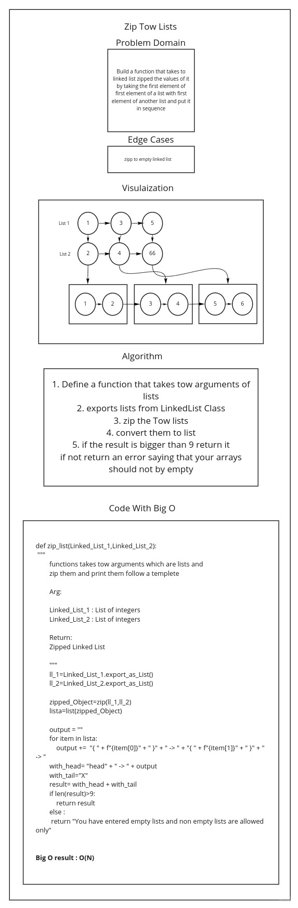

# Zip tow Linked List

<!-- Description of the challenge -->

Zip two linked lists.

## Approach & Efficiency

<!-- What approach did you take? Discuss Why. What is the Big O space/time for this approach? -->

## Requirements

* [x] Write a function called zip lists
* [x] Arguments: 2 linked lists
* [x] Return: Linked List, zipped as noted below
* [x] Zip the two linked lists together into one so that the nodes alternate between the two lists and return a reference to the head of the zipped list.
* [x] Try and keep additional space down to O(1)
* [x] You have access to the Node class and all the properties on the Linked List class as well as the methods created in previous challenges.

## Test Requirements

On this, and all future challenges, write tests for any cases that help you ensure your code is working as expected. Think through different edge cases to determine what tests will ensure your code is covered.

* [x] Check linked list is  zipped after add to Linked List
* [x] Check linked list zipped after append to Linked List
* [x] Check if linked list zipped with insert after a value of List
# White Board

