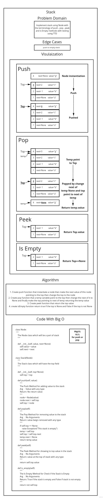

# Zip tow Linked List

<!-- Description of the challenge -->

Implementation of Stacks and Queues

## Approach & Efficiency

<!-- What approach did you take? Discuss Why. What is the Big O space/time for this approach? -->

* Stack
    - Pushing a Node onto a stack will always be an O(1) operation.
    - Popong a Node from a stack will always be an O(1) operation.

## Requirements

### Stack

* [x] Create a Stack class that has a top property. It creates an empty Stack when instantiated.
* [x] This object should be aware of a default empty value assigned to top when the stack is created.
* [x] The class should contain the following methods:
    - [x] push
        - Arguments: value
        - adds a new node with that value to the top of the stack with an O(1) Time performance.
    - [x] pop
        - Arguments: none
        - Returns: the value from node from the top of the stack
        - Removes the node from the top of the stack
        - Should raise exception when called on empty stack peek
    - [x]peek
        - Arguments: none
        - Returns: Value of the node located at the top of the stack
        - Should raise exception when called on empty stack
    - [x] is empty
        - Arguments: none
        - Returns: Boolean indicating whether or not the stack is empty.

## Test Requirements

* Stack
    - [x] Can successfully push onto a stack
    - [x] Can successfully push multiple values onto a stack
    - [x] Can successfully pop off the stack
    - [x] Can successfully empty a stack after multiple pops
    - [x] Can successfully peek the next item on the stack
    - [x] Can successfully instantiate an empty stack
    - [x] Calling pop or peek on empty stack raises exception

# White Board

