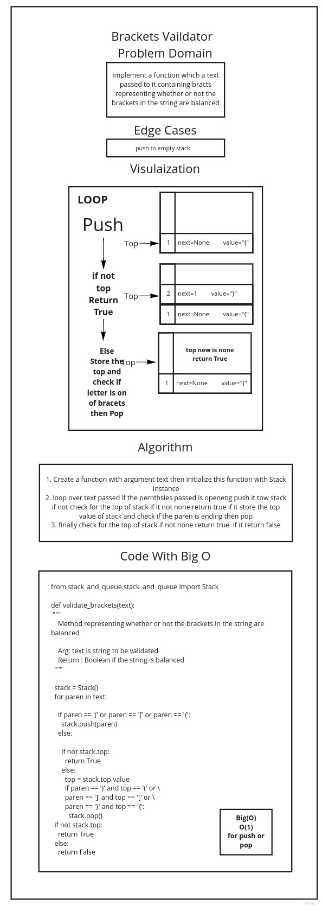

# Multi-bracket Validation

Multi-bracket Validation.

## Approach & Efficiency

BigO(1) for push or pop

## Requirements

* [x]    Write a function called validate brackets
* [x] Arguments: string
* [x] Return: boolean
    - [x] representing whether or not the brackets in the string are balanced
    There are 3 types of brackets:

* [x] There are 3 types of brackets:
    - Round Brackets : ()
    - Square Brackets : []
    - Curly Brackets : {}

## Test Requirements

    - [x] Test if we passed a vaild cases
    - [x] Test if we passed an invalid cases
# White Board

