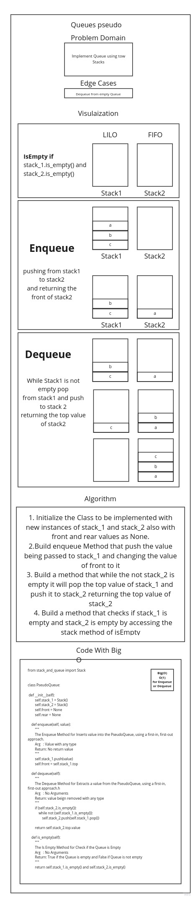

# Zip tow Linked List

Implement a Queue using two Stacks.

## Approach & Efficiency

* O(1) for Enqueue or Dequeue

## Requirements

* [x] Create a new class called pseudo queue.

    - [x] Do not use an existing Queue.
    - [x] Instead, this PseudoQueue class will implement our standard queue interface (the two methods listed below),
    - [x] Internally, utilize 2 Stack instances to create and manage the queue

* [x] Methods:

    - [x] enqueue
        Arguments: value
        Inserts value into the PseudoQueue, using a first-in, first-out approach.

    - [x] dequeue
        Arguments: none
        Extracts a value from the PseudoQueue, using a first-in, first-out approach.h

## Test Requirements

    - [x] Can successfully enqueue into a queue
    - [x] Can successfully enqueue multiple values into a queue
    - [x] Can successfully dequeue out of a queue the expected value
    - [x] Can successfully peek into a queue, seeing the expected value
    - [x] Can successfully empty a queue after multiple dequeues
    - [x] Can successfully instantiate an empty queue
    - [x] Calling dequeue or peek on empty queue raises exception
# White Board

