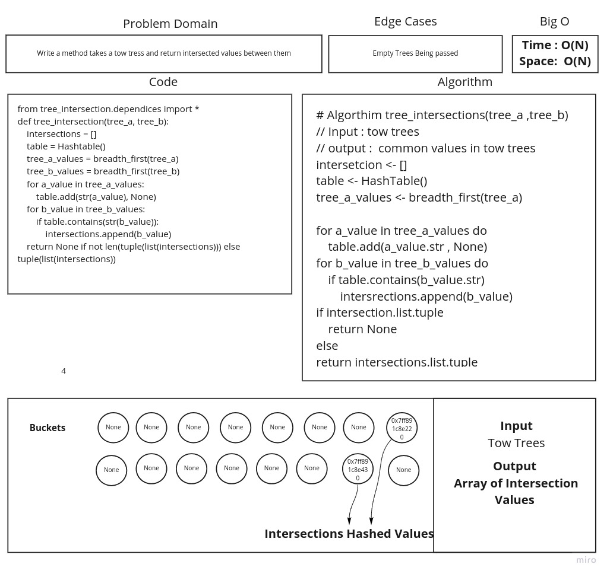

# Tree Intersection

## Challenge

Find common values in 2 binary trees.

## Approach & Efficiency

Time :
Space :

## Feature Tasks

* [] Write a function called tree_intersection that takes two binary trees as parameters.
* [] Using your Hashmap implementation as a part of your algorithm, return a set of values found in both trees.
* 
## Requirements

* [x] Write unit tests
# White Board

