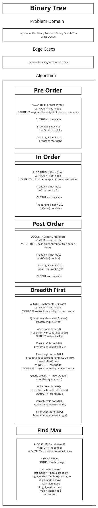
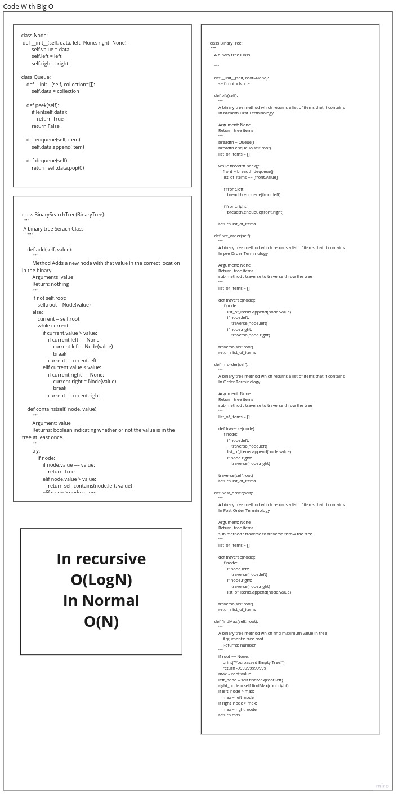

# Trees

## Challenge

Implement Binary Tree and BST

## Approach & Efficiency

## Requirements

1. Node

* [x] Create a Node class that has properties for the value stored in the node, the left child node, and the right child node.

2. Binary Tree

* [x] Create a Binary Tree class
    - [x] Define a method for each of the depth first traversals:
        * [x] pre order
        * [x] in order
        * [x] post order which returns an array of the values, ordered
        appropriately.
        * [x] find maximum returns the maximum value of tree
* [x] Any exceptions or errors that come from your code should be semantic, capture-able errors. For example, rather than a default error thrown by your language, your code should raise/throw a custom, semantic error that describes what went wrong in calling the methods you wrote for this lab.

3. Binary Search Tree

* [x] Create a Binary Search Tree class
    - [x] This class should be a sub-class (or your languages equivalent) of the Binary Tree Class, with the following additional methods:
    - [x] Add
        * [x] Arguments: value
        * [x] Return: nothing
        * [x] Adds a new node with that value in the correct location in the binary search tree.
    - [x] Contains
        * [x] Argument: value
        * [x] Returns: boolean indicating whether or not the value is in the tree at least once.

## Test Requirements

* [x] Can successfully instantiate an empty tree
* [x] Can successfully instantiate a tree with a single root node
* [x] Can successfully add a left child and right child to a single root node
* [x] Can successfully return a collection from a preorder traversal
* [x] Can successfully return a collection from an inorder traversal
* [x] Can successfully return a collection from a postorder traversal
# White Board

